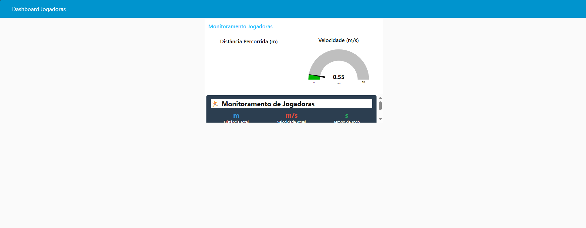
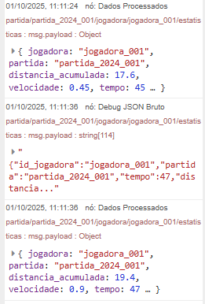
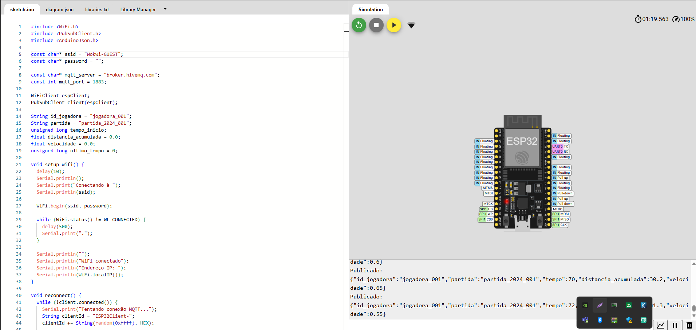
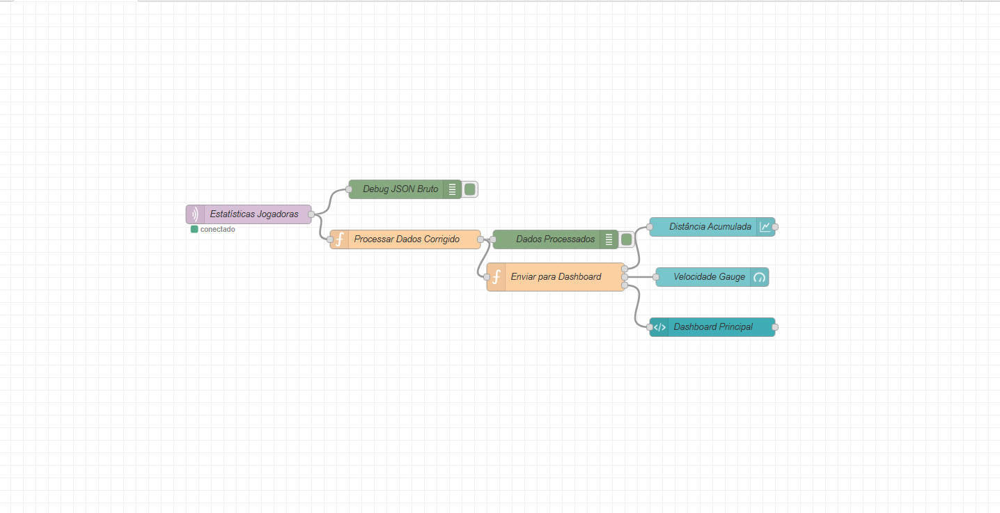

### 🏃 Passa a Bola – Monitoramento de Jogadoras

Sistema de IoT para simulação de coleta de dados atléticos em tempo real durante partidas de futebol feminino. O projeto monitora velocidade e distância percorrida por jogadoras, transmitindo dados via MQTT para processamento e visualização em dashboard.

## 🏗️ Arquitetura da Solução
[Wokwi - ESP32 Simulado] → [MQTT Broker] → [Node-RED] → [Dashboard + Debug]
↓ ↓ ↓ ↓
Geração de Transmissão Processamento Visualização
dados simulados dos dados e filtragem em tempo real

**Fluxo de Dados:**
1. **Wokwi**: Simula sensores de movimento em ESP32
2. **MQTT**: Broker público HiveMQ para comunicação
3. **Node-RED**: Consome, processa e visualiza dados
4. **Dashboard**: Interface web com gráficos e métricas

## ⚙️ Funcionalidades

- **🎯 Simulação de Dados Atléticos**
  - Geração de velocidade instantânea (0-10 m/s)
  - Cálculo de distância acumulada em metros
  - Timestamp automático do tempo de partida

- **📡 Comunicação MQTT**
  - Publicação em tópicos estruturados
  - Formato JSON padronizado
  - Broker público HiveMQ

- **📊 Dashboard Node-RED**
  - Indicador numérico: distância acumulada
  - Visualização em tempo real

- **🐛 Debug Técnico**
  - Validação via JSON bruto
  - Monitoramento do fluxo de dados
  - Logs de processamento

## 🛠️ Tecnologias Utilizadas

| Tecnologia | Finalidade |
|------------|------------|
| **Wokwi** | Simulação online de ESP32 |
| **ESP32** | Microcontrolador para IoT |
| **MQTT** | Protocolo de comunicação IoT |
| **Node-RED** | Plataforma de desenvolvimento visual |
| **HiveMQ** | Broker MQTT público |
| **JSON** | Formato de intercâmbio de dados |

## 🚀 Como Executar

### Pré-requisitos
- Node-RED instalado localmente
- Acesso à internet para broker MQTT público

### 1. Configuração do Wokwi

// Código disponível em /wokwi/sketch.ino
// Simula dados de jogadora e publica via MQTT
Passos:

Acesse Wokwi ESP32 Simulator

Cole o código do arquivo sketch.ino

Adicione as bibliotecas: PubSubClient e ArduinoJson

Execute a simulação

2. Configuração MQTT
json
{
  "broker": "broker.hivemq.com",
  "porta": 1883,
  "tópico": "partida/{id_partida}/jogadora/{id_jogadora}/estatisticas"
}
3. Importação no Node-RED
bash
# Instalar dashboard se necessário
npm install node-red-dashboard
Passos:

Acesse Node-RED (geralmente http://localhost:1880)

Menu → Import → Clipboard

Cole o JSON do fluxo (disponível em /node-red/fluxo_completo.json)

Clique em Deploy

4. Estrutura dos Dados
json
{
  "id_jogadora": "jogadora_001",
  "partida": "partida_2024_001",
  "tempo": 120,
  "distancia_acumulada": 45.75,
  "velocidade": 3.2
}

Dashboard em Funcionamento:

Gráfico de velocidade em tempo real

Indicador de distância acumulada

Informações da jogadora e partida

Debug JSON:

json
{
  "topic": "partida/partida_2024_001/jogadora/jogadora_001/estatisticas",
  "payload": {
    "id_jogadora": "jogadora_001",
    "partida": "partida_2024_001",
    "tempo": 45,
    "distancia_acumulada": 125.75,
    "velocidade": 3.2
  }
}
👥 Integrantes
Nome	RM
Felipe Murad	562347
Guilherme Barone	562114
Leandro Junior	561344
Lucas Massoni	561686
Luigi Escudero	562505

## 📸 Demonstração

### Dashboard Node-RED

### Debug JSON

### Simulação Wokwi

### Fluxo Node-RED

### App Mobile (Opcional)

📄 Licença
Este projeto foi desenvolvido para fins acadêmicos. Distribuído sob licença educacional.

